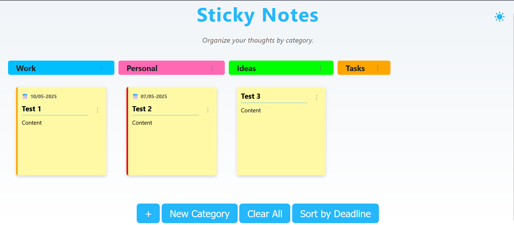
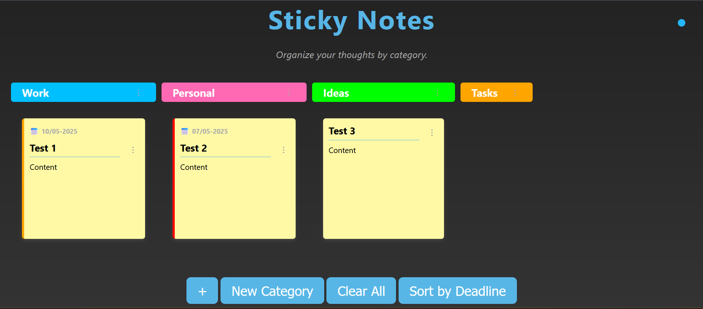

# Sticky Notes App

A simple yet powerful web-based sticky notes application built with HTML, CSS, and JavaScript. Easily manage your digital notes with a modern, responsive design and rich customization options.

## ✨ Key Features

* **📝 Create and Edit Notes** – Add, edit, and delete sticky notes directly in the browser.
* **🌓 Dark Mode** – Switch between light and dark themes for a more comfortable experience.
* **🗂️ Categorize Notes** – Organize notes by categories for better structure.
* **🎨 Custom Note Colors** – Choose from a range of colors to personalize your notes.
* **📅 Deadlines** – Set deadlines for notes, with color-coded warnings for approaching or missed deadlines.
* **🗑️ Clear All Notes** – Remove all notes with a single click.
* **📦 Local Storage** – Your notes are saved locally, so they persist across sessions.
* **🖱️ Drag and Drop** – Easily rearrange notes within categories.

## 📸 Preview

## 🚀 Technologies Used

* **HTML5** – Markup structure
* **CSS3** – Styling with Flexbox and responsive design
* **JavaScript (ES6)** – Client-side functionality and local storage

## 👥 Contributors

* Albin Tetli
* Kai Hodges

## Webadress 

[tetli.net](https://tetli.net/)

## 📄 License

This project is licensed under the MIT License.
